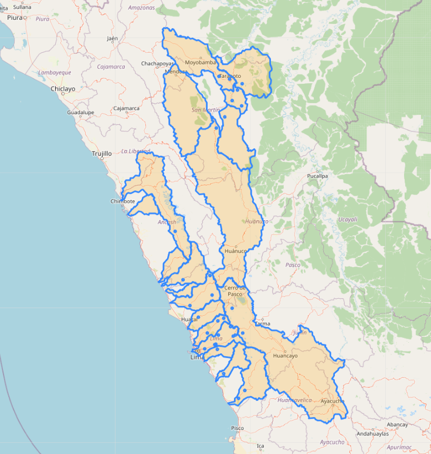

# Contenido
Este repositorio contiene los codigos del analisis de umbrales para control de calidad de niveles de rios para DZ4 y DZ9 SENAMHI.

- [0. Maestro](https://github.com/JoseZevallosR/umbrales_estaciones/blob/main/notebooks/0.%20Maestro.ipynb)
- [1. Base de datos SQL Convencionales](https://github.com/JoseZevallosR/umbrales_estaciones/blob/main/notebooks/1.%20Base%20de%20datos%20SQL%20Convencionales.ipynb)
- [2. Base de datos SQL Automaticas](https://github.com/JoseZevallosR/umbrales_estaciones/blob/main/notebooks/2.%20Base%20de%20datos%20SQL%20Automaticas.ipynb)
- [3. Umbrales para Convencionales](https://github.com/JoseZevallosR/umbrales_estaciones/blob/main/notebooks/3.%20Convencionales_umbrales.ipynb)
- [4. Umbrales para Automaticas](https://github.com/JoseZevallosR/umbrales_estaciones/blob/main/notebooks/4.%20Automaticas_umbrales.ipynb)

